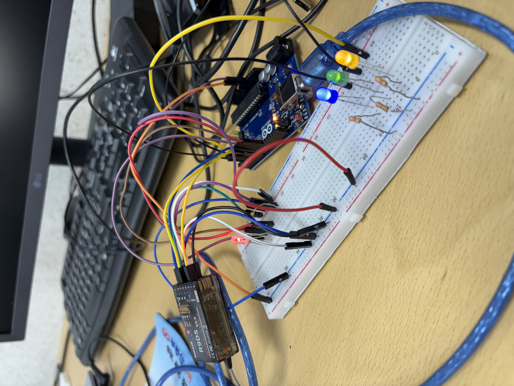
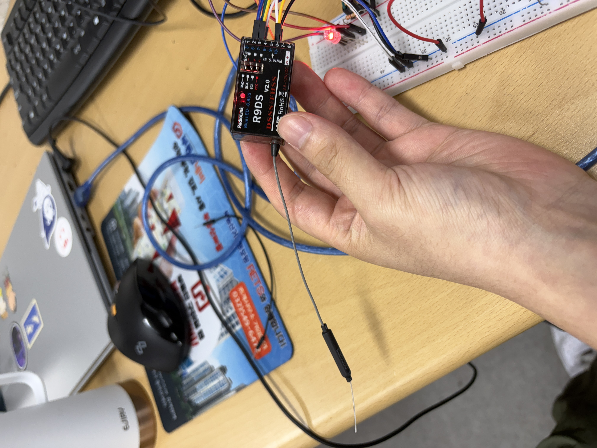

# 🎛️ RC 수신기 기반 HSV + 단색 LED 제어 시스템

이 프로젝트는 RC 수신기의 PWM 신호(CH2, CH3, CH6)를 활용해 **HSV 기반 RGB LED 색상 제어**와 **단색 LED 밝기 조절**, 그리고 **전원 ON/OFF 제어** 기능을 구현한 아두이노 기반 조명 시스템입니다.

> `PinChangeInterrupt` 라이브러리를 사용하여 고속 PWM 신호를 정확하게 측정하며, HSV 색상 모델을 통해 부드럽고 자연스러운 색 전환이 가능합니다.

---

## ✨ 주요 기능

| 채널 | 역할           | PWM 범위 (μs) | 설명                         |
|------|----------------|----------------|------------------------------|
| CH2  | 밝기 조절       | 1200 ~ 1800     | 단색 LED 3종 (노랑, 초록, 파랑) 밝기 제어 |
| CH3  | HSV 색상 조절   | 1000 ~ 2000     | 색상(Hue)을 0 ~ 270도 범위로 매핑       |
| CH6  | 전체 ON/OFF     | ≥1800 / 그 외   | 전체 LED ON / OFF 전환          |

---

## 🧩 하드웨어 구성

| 부품             | 핀 번호 | 설명                    |
|------------------|---------|-------------------------|
| RGB LED (PWM)     | 9       | 파랑 (Blue)             |
|                   | 10      | 초록 (Green)            |
|                   | 11      | 빨강 (Red)              |
| 단색 LED (PWM)    | 3       | 파랑 LED (Blue2)        |
|                   | 5       | 초록 LED (Green2)       |
|                   | 6       | 노랑 LED (Yellow)       |
| RC 수신기         | 8       | CH2 - 단색 LED 밝기 입력 |
|                   | 7       | CH3 - HSV 색상 선택 입력 |
|                   | 4       | CH6 - 전원 ON/OFF 입력  |

> 모든 LED 핀은 `analogWrite()`를 사용하는 PWM 핀이어야 합니다.

---

## 📦 필요 라이브러리

- [PinChangeInterrupt](https://github.com/NicoHood/PinChangeInterrupt)

**설치 방법**  
Arduino IDE → **스케치 > 라이브러리 포함하기 > 라이브러리 관리** → "PinChangeInterrupt" 검색 후 설치

---

## 🚀 사용 방법

1. 아두이노에 코드를 업로드합니다.
2. RC 수신기에서 CH2, CH3, CH6을 핀 8, 7, 4에 연결합니다.
3. 회로를 구성하고 LED를 연결합니다.
4. 송신기로:
   - CH6 스위치 → LED 전체 ON/OFF
   - CH3 조절 → RGB 색상 변경 (Hue 0~270도)
   - CH2 조절 → 단색 LED 밝기 조절 (0~255)

---

## 🔧 코드 작동 방식 요약

- **PWM 신호 감지**: `PinChangeInterrupt`를 통해 CH2, CH3, CH6의 HIGH 펄스 길이를 마이크로초 단위로 측정
- **HSV → RGB 변환**: `hsvToRgb()` 함수를 통해 사용자가 설정한 색상(Hue)을 RGB 값으로 변환
- **밝기 제어**: CH2 입력을 기반으로 단색 LED의 `analogWrite` 값 결정
- **스위치 제어**: CH6이 1800μs 이상이면 전체 시스템 ON, 아니면 OFF

---

## 📷 시연 이미지 / 영상

> [![PWM LED 제어 시연][(https://img.youtube.com/vi/dQw4w9WgXcQ/0.jpg)](https://www.youtube.com/watch?v=dQw4w9WgXcQ)](https://youtu.be/ioahYYO6-vk)

---

## 👥 개발자 및 기여 내용

이 프로젝트는 두 명이 협업하여 제작하였습니다:

- **윤창혁**  
  🎨 HSV 색상 기반 **3색 RGB LED 제어 로직** 및 `hsvToRgb()` 변환 함수 구현

- **심창완**  
  💡 **단색 LED 3개 밝기 제어**, **ON/OFF 스위치 기능** 및 전체 통합 로직 구현

> 각자 담당한 기능을 나눠 개발하고, 최종적으로 하나의 시스템으로 통합하였습니다.

> 하드웨어 구성은 2명이 협업하여 완성했습니다.

